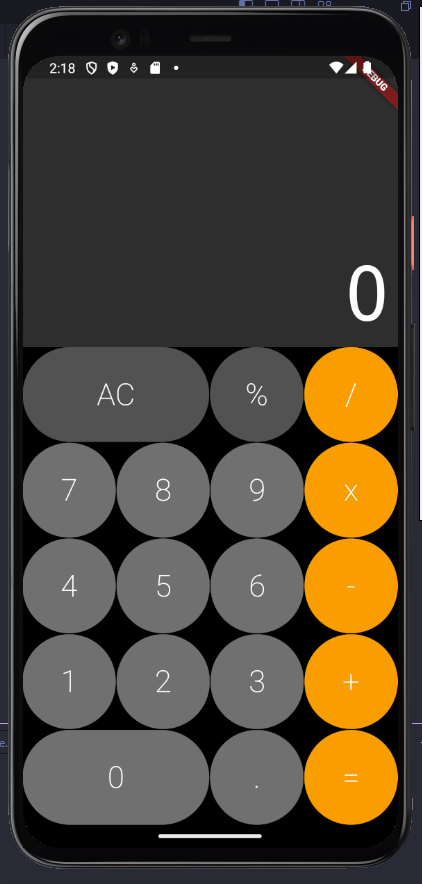

# Calculadora Flutter

Este é um projeto de uma calculadora simples desenvolvida em Flutter. O objetivo é proporcionar uma interface intuitiva e fácil de usar, semelhante a uma calculadora comum, utilizando componentes do Flutter.

## Visão Geral

A calculadora possui uma interface de usuário minimalista com botões para operações básicas, como adição, subtração, multiplicação, divisão, porcentagem, e um botão de reset (`AC`). O aplicativo é responsivo e funciona tanto em dispositivos Android quanto iOS.



## Funcionalidades

- **Operações básicas**: Adição, subtração, multiplicação, divisão.
- **Porcentagem**: Cálculo de porcentagem.
- **Reset**: Limpeza de todos os dados da tela.
- **Responsividade**: Interface adaptada para diferentes tamanhos de telas.

## Tecnologias Utilizadas

- **Flutter**: Framework utilizado para o desenvolvimento do aplicativo.
- **Dart**: Linguagem de programação utilizada.

## Como Executar o Projeto

Para executar este projeto, certifique-se de ter o Flutter instalado e configurado em sua máquina. Siga os passos abaixo:

1. Clone o repositório:
   ```bash
   git clone https://github.com/alyssonzanchi/calculator.git
   ```
2. Acesse o diretório do projeto:
   ```bash
   cd calculator
   ```
3. Instale as dependências:
   ```bash
   flutter pub get
   ```
4. Execute o aplicativo:
   ```bash
   flutter run
   ```

## Sobre o Curso

Este projeto faz parte do [Curso Completo de Flutter](https://www.udemy.com/course/curso-flutter/?couponCode=SKILLS4SALEB) disponível na Udemy. O curso aborda o desenvolvimento de aplicações móveis com Flutter, ensinando desde os fundamentos até técnicas mais avançadas. Esta calculadora foi criada como uma das atividades práticas para aplicar os conhecimentos adquiridos.

## Contribuindo

Contribuições são bem-vindas! Se você deseja melhorar o projeto, sinta-se à vontade para abrir uma issue ou enviar um pull request.

## Licença

Este projeto está sob a licença MIT. Veja o arquivo [LICENSE](LICENSE) para mais detalhes.

##
Feito com ❤️ por [Alysson Zanchi](https://www.linkedin.com/in/alyssonzanchi/).
